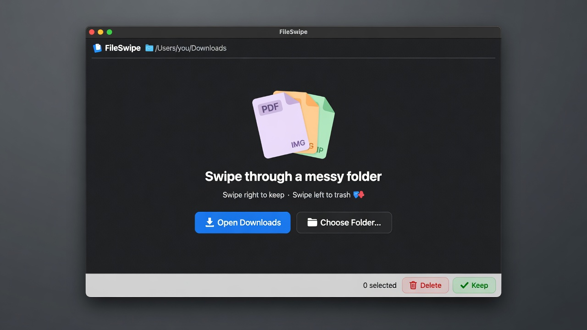
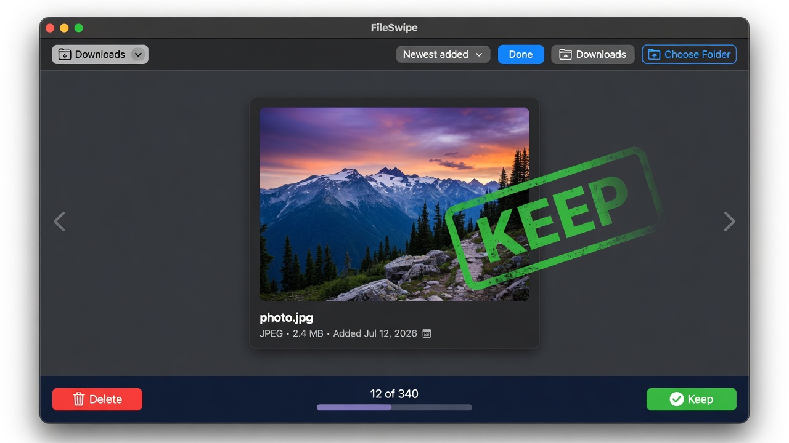
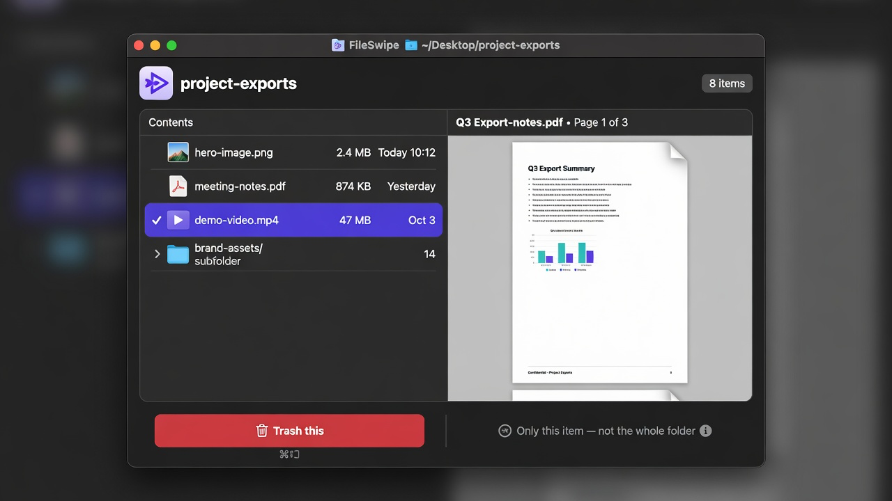
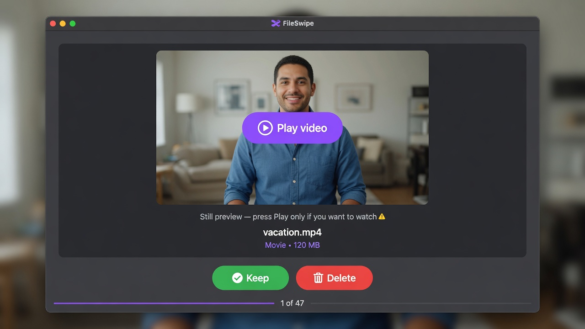

# FileSwipe

**Clean messy folders (like Downloads) by swiping — like Tinder, for files.**

macOS app · free · open source (MIT)

---

### What it does

Pick a folder. See one file at a time. Decide:

| Action | How | What happens |
|--------|-----|----------------|
| **Keep** | Swipe **right** or press **Keep** | File stays put. Nothing is changed. |
| **Delete** | Swipe **left** or press **Delete** | File goes to the **Mac Trash** (not gone forever). |
| **Done** | Click **Done** | Leave this folder and pick another. |

You can **undo**, **peek inside folders**, **preview images/PDFs**, and **play videos** before you decide.

---

### Screenshots

<p align="center">
  
</p>

<p align="center"><em>Start here — open Downloads or any folder</em></p>

<p align="center">
  
</p>

<p align="center"><em>Swipe right to keep · left to trash</em></p>

<p align="center">
  
</p>

<p align="center"><em>Inside a folder: trash one item without deleting the whole folder</em></p>

<p align="center">
  
</p>

<p align="center"><em>Videos show a still first — press Play to watch and scrub</em></p>

---

### Install & run (Mac)

**You need:** a Mac with macOS 14+, and [Xcode](https://developer.apple.com/xcode/) from the App Store.

```bash
# 1. Clone
git clone https://github.com/thiernoyunus/FileSwipe.git
cd FileSwipe

# 2. Create the Xcode project (needs XcodeGen once)
brew install xcodegen   # only if you don't have it
xcodegen generate

# 3. Open & run
open FileSwipe.xcodeproj
```

In Xcode:

1. Select the **FileSwipe** scheme  
2. Choose **My Mac**  
3. Press **Run** (⌘R)

Allow access if macOS asks for your Downloads folder.

#### Build from the terminal (optional)

```bash
xcodegen generate
xcodebuild -scheme FileSwipe -configuration Debug -destination 'platform=macOS' build
```

The app lands in Xcode’s DerivedData folder; easier path is still **Run** from Xcode.

---

### How to use (2 minutes)

1. Click **Open Downloads** (or **Choose Folder…**).
2. Look at the file.
3. **Swipe right** (or **Keep**) if you want it.
4. **Swipe left** (or **Delete**) to send it to Trash.
5. Click **Done** when you’re finished, or pick another folder.

#### Folders

- A folder is **one card**.
- Click files inside to preview them.
- Use **Trash this** to remove only one thing inside.
- Swipe left only if you want the **whole folder** in Trash.

#### Videos

- You see a **thumbnail** first.
- Press **Play** to watch; drag the bar to scrub.
- Close the player to go back to the still.

#### Optional keyboard

Off by default. Click the **keyboard** icon to turn shortcuts on and pick your own Keep / Delete keys.

---

### Safety

- **Delete** = move to Trash (you can recover from Trash).
- **Keep** = do nothing to the file (no rename, no move, no “date added” change).
- **Undo** (⌘Z) reverses the last keep or trash when possible.
- The app only sees folders **you** open (plus Downloads when you allow it).

---

### Requirements

| | |
|--|--|
| OS | macOS 14.0 or later |
| Hardware | Apple Silicon or Intel Mac |
| Tools to build | Xcode 15+, [XcodeGen](https://github.com/yonaskolb/XcodeGen) |

---

### Project structure

```
FileSwipe/
├── FileSwipe/                 # App source
│   ├── FileSwipeApp.swift
│   ├── ContentView.swift
│   ├── Models/
│   ├── Services/
│   └── Views/
├── project.yml                # XcodeGen definition
├── LICENSE                    # MIT
├── CONTRIBUTING.md
└── docs/screenshots/
```

---

### Contributing

See [CONTRIBUTING.md](CONTRIBUTING.md). Bug reports and simple PRs welcome.

---

### License

[MIT](LICENSE) — free to use, share, and change.

---

### Name

**FileSwipe** — swipe to clean. Keep what matters; trash the rest.
